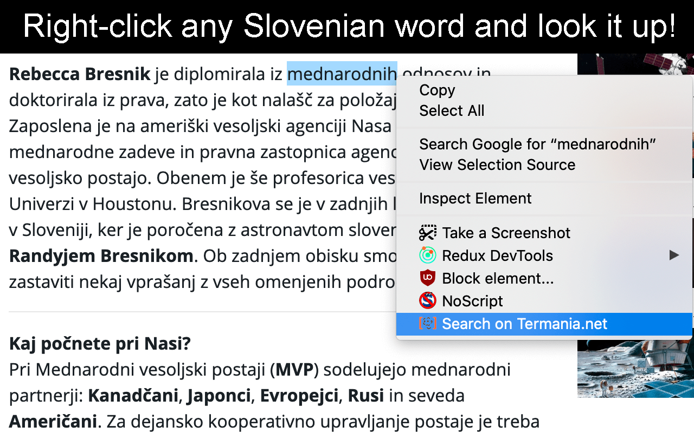
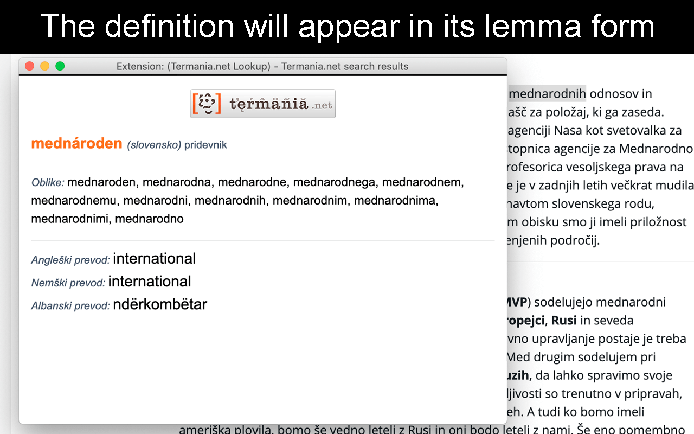

# Termania.net Lookup Google Chrome Extension

This Google Chrome extension enables foreigners as well as Slovenian native speakers to search the extensive Slovenian
dictionary search engine [Termania.net](https://www.termania.net) with the click of a single button.

## Why yet another Google Chrome Extension
I wanted to build something that actually solves a problem and helps people, especially foreigners
who are trying to learn the Slovenian language.

## Why Chrome and not Firefox?
**2 reasons:**
1. Because according to the [latest statistics](https://gs.statcounter.com/browser-market-share) Google
Chrome has a whooping **64.3%** market share and Firefox has only **4.49%**.
2. I only have so much free time on my hands :hourglass_flowing_sand:

## How does it work?
The user first needs to select a Slovenian word and right-click it to open Chrome's context menu:



In order to query only the [lemmas][1] of each word form the extension makes use of the
[Morphological lexicon Sloleks 2.0](http://eng.slovenscina.eu/sloleks/opis) indexed in an IndexedDB database
which holds over 100.000 lemmas.
In order to get the [1.5 GB lexicon from XML](https://www.clarin.si/repository/xmlui/handle/11356/1230) to SQLite and
then finally into IndexedDB I wrote [parser](https://github.com/techouse/sloleks-parser) in Python.

Once the correct lemma is identified an API call gets sent to [Termania.net](https://www.termania.net)
which in turn supplies all the information that is then presented to the user in a popup window.



## Why is the installation of the extension taking so long?
Unfortunately the Sloleks database housing all those 100.000 lemmas is quite large (approx. 50MB)
and importing it into IndexedDB takes about 5 minutes to complete during which time you wou't be
able to use the extension.

## How do I build it from source?
The extension uses a lot of different JavaScript libraries and has to be compiled with [npm](https://nodejs.org/en/)
and [Webpack](https://webpack.js.org). Ensure you have `Node.js` and `npm` installed and run these commands:

```bash
npm install
npm run build
```

The finished extension will present itself in a directory called `build`. From there you can
[load it as an unpacked extension](https://stackoverflow.com/questions/24577024/install-chrome-extension-not-in-the-store).


[1]: https://en.wikipedia.org/wiki/Lemma_(morphology)
